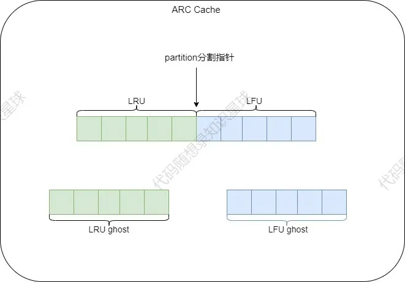
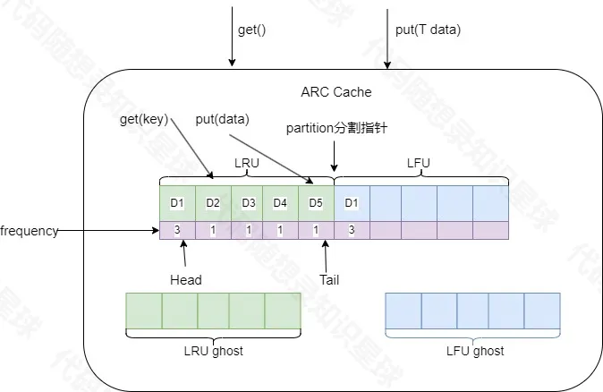

# ARC算法
实际LFU也有自己的缺点，首先，引入访问频率机制可能会导致一些新加入的数据被排挤，并且频率统计会带来不小的额外开销，在频繁进出新数据的环境下也会比较吃力

## 定义
综合了两种策略的特点，当访问的数据趋向于访问最近的内容，会更多地命中LRU list，这样会增大LRU的空间；当系统趋向于访问频繁访问的内容时，会更多地命中LFU list，这样会增加LFU的空间。

## 执行过程
1. 整个Cache分为两部分，LRU和LFU各占一半，根据不同的访问模式动态适应调整`partition`分割指针的位置（不一定存在这个指针，只是说明会动态调整二者的内存大小），除此之外，LRU和LFU各自有一个`ghost list`（淘汰链表，分别用于存储从LRU和LFU中淘汰的数据，也可以叫做幽灵链表）。  




2. 在缓存中查找客户端需要访问的数据，如果没有命中，表示缓存穿透，将需要访问的数据从从磁盘中取出，从LRU对应链表的尾部（本代码使用尾插头出）。
3. 如果命中且LFU链表中没有则判断该数据的访问次数是否大于`transformTime`_（转换阈值，本代码设置为2），若大于则将该数据插入LFU对应链表中（一个块至少需要读取`transformTime_`次，并且要是最近请求的数据，才会被存储到LFU中）。于是，**该数据块不仅仅只保存在LRU的缓存目录中，也将保存到LFU中**。如果命中且LFU链表中存在，则将数据重新放入LFU链表中对应位置（访问频次计数+1），这样，那些真正被频繁访问的页面将一直呆在缓存中，不会被冷数据的加入而误淘汰，不经常访问的数据会向链表头部移动，最终被淘汰出去。
4. 如果此时LRU缓存满了，则从LRU链表中淘汰表头部的数据，将淘汰数据的key放入LRU对应的`ghost list`。然后在LRU的链表尾部添加新数据。如果`ghost list`的元素满了，按照先进先出的方式淘汰`ghost list`中的元素头部元素，然后再从尾部插入元素。
5. 如未命中缓存的数据根据key发现在LRU对应的`ghost list`中，则表示幽灵命中，缓存系统就可以知道，这是一个刚刚淘汰的页面，而不是第一次读取或者说很久之前读取的一个页面。于是根据这个信息来调整内部的`partition`分割指针以适应当下的访问模式。上述迹象说明当前的LRU缓存太小了，于是将`partition`分割指针右移一位(也就是LRU缓存空间+1，LFU缓存空间-1），并将命中的key数据从`ghost list`的中移除，将新数据从LRU链表尾部插入。
6. 反之如果未命中缓存的数据根据key发现在LFU对应的`ghost`中，则说明当前访问模式偏向于频繁访问经常被访问的那一些数据，说明当下LFU缓存空间太小了，对应`partition`分割指针左移一位，并将命中的key数据从`ghost`的中移除，将新数据从LRU链表尾部插入。

* **分割指针只是想象中的比喻物，在代码中实际上不存在这个分割指针，分割的操作会被几个函数控制**

## 代码实现
ARC的代码实现相当复杂，需要分为四个板块，这可能也是ARC的缺点之一

### ArcCacheNode
```
#pragma once
# include <memory>

namespace CopCache {
	template <typename Key,typename Value>
	class ArcNode
	{
	private:
		Key key_;
		Value value_;
		size_t accessCount_;//对于该节点的访问频次
		std::shared_ptr<ArcNode> prev_;
		std::shared_ptr<ArcNode> next_;//前驱指针与后继指针
	public:
		//含参构造函数与无参构造函数
		ArcNode():accessCount_(1),prev_(nullptr),next_(nullptr){}

		ArcNode(Key key,Value value)
			:key_(key)
			,value_(value)
			,accessCount_(1)
			,prev_(nullptr)
			,next_(nullptr)
		{}

		//定义获取键，值，访问频次函数
		Key getKey() const { return key_; }
		Value getValue() const { return value_; }
		size_t getAccessCount() const { return accessCount_; }

		//定义修改值与访问频次的函数
		void setValue(const Value& value) { value_ = value; }
		void incrementAccessCount() { ++accessCount_; }

		//将lru与lfu定义为友元类，便于访问节点类
		template <typename K, typename V> friend class ArcLruPart;
		template <typename K, typename V> friend class ArcLfuPart;

	};

}// coloop
```

* 节点部分，包含了对应节点的相关操作，以及节点的一些属性（键，值，访问次数，前驱与后继指针）

### ArcCacheLruPart
```
#pragma once

#include "CopArcCacheNode.h"
#include <unordered_map>
#include <mutex>

namespace CopCache {
	template <typename Key,typename Value>
	class ArcLruPart
	{
	public:
		//类型别名
		using NodeType = ArcNode<Key, Value>;
		using NodePtr = std::shared_ptr<NodeType>;
		using NodeMap = std::unordered_map<Key, NodePtr>;

		explicit ArcLruPart(size_t capacity, size_t transformThreshold) 
			:capacity_(capacity)
			,ghostCapacity_(capacity)
			,transformThreshold_(transformThreshold)
		{
			initializeLists();
		}

		bool put(Key key, Value value)
		{
			if (capacity_ == 0) return false;

			//线程锁
			std::lock_guard <std::mutex> lock(mutex_);
			auto it = MainCache_.find(key);
			if (it != MainCache_.end()) {
				return updateExistingNode(it->second, value);
			}
			return addNewNode(key, value);
		}

		//传出两个参数 值 和 是否达到转换阈值判断
		bool get(Key key, Value& value, bool& shouldTransform)
		{
			std::lock_guard <std::mutex> lock(mutex_);

			auto it = MainCache_.find(key);
			if (it != MainCache_.end())
			{
				//更新访问频次，并判断是否达到转换阈值
				shouldTransform = updateNodeAccess(it->second);
				value = it->second->getValue();
				return true;
			}
			return false;
		}

		//检查幽灵缓存中是否存在对于节点
		bool checkGhost(Key key)
		{
			auto it = GhostCache_.find(key);
			if (it != GhostCache_.end())
			{
				removeFromGhost(it->second);
				GhostCache_.erase(it);
				return true;
			}
			return false;
		}

		//增加缓存容量
		void increaseCapacity() { ++capacity_; }

		// 减少缓存容量
		bool decreaseCapacity()
		{
			if (capacity_ <= 0) return false;
			//缓存满时需要驱逐一位缓存
			if (MainCache_.size() == capacity_)
			{
				evictLeastRecent();
			}
			--capacity_;
			return true;
		}


	private:
		//初始化
		void initializeLists() {
			//连接主链表
			mainHead_ = std::make_shared<NodeType>();
			mainTail_ = std::make_shared<NodeType>();
			mainHead_->next_ = mainTail_;
			mainTail_->prev_ = mainHead_;

			//连接幽灵链表
			ghostHead_ = std::make_shared<NodeType>();
			ghostTail_ = std::make_shared<NodeType>();
			ghostHead_->next_ = ghostTail_;
			ghostTail_->prev_ = ghostHead_;
		}

		//更新在缓存中的值
		bool updateExistingNode(NodePtr node, const Value& value) 
		{
			node->setValue(value);
			moveToFront(node);
			return true;
		}

		bool addNewNode(const Key& key, const Value& value)
		{
			if (MainCache_.size() >= capacity_)
			{
				//满缓存后需要驱逐最近最少访问节点
				evictLeastRecent();
			}

			//构造新节点并存入缓存中，并将节点插入头部
			NodePtr newNode = std::make_shared<NodeType>(key, value);
			MainCache_[key] = newNode;
			addToFront(newNode);
			return true;

		}

		bool updateNodeAccess(NodePtr node)
		{
			//更新节点的访问次数，并且判断是否符合转换阈值
			moveToFront(node);
			node->incrementAccessCount();
			return node->getAccessCount() >= transformThreshold_;
		}

		//移动节点至头部
		void moveToFront(NodePtr node)
		{
			//从当前位置移除
			node->prev_->next_ = node->next_;
			node->next_->prev_ = node->prev_;

			
			addToFront(node);

		}

		//并添加节点至头部
		void addToFront(NodePtr node)
		{
			node->next_ = mainHead_->next_;
			node->prev_ = mainHead_;
			mainHead_->next_->prev_ = node;
			mainHead_->next_ = node;
		}

		//驱逐最近最少访问节点
		void evictLeastRecent()
		{
			//这里尾部的元素是最近最少访问元素
			NodePtr leastRecent = mainTail_->prev_;
			//缓存为空则跳过
			if (leastRecent == mainHead_)
				return;
			
			//从主链表中移除
			removeFromMain(leastRecent);

			//将移除节点添加到幽灵缓存，如果缓存满则同样的方式清理
			if (GhostCache_.size() >= ghostCapacity_)
			{
				removeOldestGhost();
			}

			addToGhost(leastRecent);

			//根据映射删除对于节点
			MainCache_.erase(leastRecent->getKey());

		}

		void removeFromMain(NodePtr node)
		{
			node->prev_->next_ = node->next_;
			node->next_->prev_ = node->prev_;

		}

		//从幽灵缓存中移除，写两个函数只是为了好区分
		void removeFromGhost(NodePtr node)
		{
			node->prev_->next_ = node->next_;
			node->next_->prev_ = node->prev_;
		}

		// 添加到幽灵缓存中
		void addToGhost(NodePtr node)
		{
			//重置访问次数
			node->accessCount_=1;

			//添加到幽灵缓存头部
			node->next_ = ghostHead_->next_;
			node->prev_ = ghostHead_;
			ghostHead_->next_->prev_ = node;
			ghostHead_->next_ = node;

			//添加到幽灵缓存映射
			GhostCache_[node->getKey()] = node;
		}

		//从幽灵缓存中驱逐最近最少使用节点，和之前的写法一样
		void removeOldestGhost()
		{
			NodePtr oldestGhost = ghostTail_->prev_;
			if (oldestGhost == ghostHead_)
				return;

			removeFromGhost(oldestGhost);
			GhostCache_.erase(oldestGhost->getKey());
		}


	private:

		size_t ghostCapacity_;
		size_t capacity_;
		size_t transformThreshold_;//转换阈值
		std::mutex mutex_;

		//主缓存与幽灵缓存

		NodeMap MainCache_;
		NodeMap GhostCache_;

		//主链表哨兵节点指针
		NodePtr mainHead_;
		NodePtr mainTail_;

		//幽灵链表哨兵节点指针
		NodePtr ghostHead_;
		NodePtr ghostTail_;


	};


} //coloop
```
LRU部分的代码

### ArcCacheLfuPart
```
#pragma once
# include "CopArcCacheNode.h"
# include <unordered_map>
#include <map>
#include <mutex>
#include <list>

namespace CopCache
{
	template <typename Key,typename Value>
	class ArcLfuPart
	{
	public:
		//类型别名
		using NodeType = ArcNode<Key, Value>;
		using NodePtr = std::shared_ptr<NodeType>;
		using NodeMap = std::unordered_map <Key, NodePtr>;//节点哈希表
		using FreqMap = std::map<size_t, std::list<NodePtr>>;//频数链表哈希表

		explicit ArcLfuPart(size_t capacity, size_t transformThreshold)
			:capacity_(capacity)
			, ghostCpacity_(capacity)
			,transformThreshold_(transformThreshold)
			,minFreq_(0)
		{
			intializeLists();
		}
		
		bool put(Key key, Value value)
		{
			if (capacity_ == 0)
				return false;

			std::lock_guard<std::mutex> lock(mutex_);
			auto it = mainCache_.find(key);
			if (it != mainCache_.end())
			{
				return updateExistingNode(it->second, value);

			}
			return addNewNode(key, value);
		}

		bool get(Key key, Value& value)
		{
			std::lock_guard<std::mutex> lock(mutex_);
			auto it = mainCache_.find(key);
			if (it != mainCache_.end()){
				//访问后需要更新频次
				updateNodeFrequency(it->second);
				value = it->second->getValue();
				return true;

			}
			return false;
		}

		bool checkGhost(Key key)
		{
			auto it = ghostCache_.find(key);
			if (it != ghostCache_.end())
			{
				removeFromGhost(it->second);
				ghostCache_.erase(it);
				return true;
			}
			return false;
		}


		void increaseCapacity() {
			++capacity_;
		}

		bool decreaseCapacity()
		{
			if (capacity_ <= 0)
				return false;
			if (mainCache_.size() == capacity_)
			{
				evictLeastFrequent();
			}
			--capacity_;
			return true;
		}


	private:
		void intializeLists() 
		{
			ghostHead_ = std::make_shared <NodeType>();
			ghostTail_ = std::make_shared <NodeType>();

			ghostHead_->next_ = ghostTail_;
			ghostTail_->prev_ = ghostHead_;
		}

		bool updateExistingNode(NodePtr node, const Value& value)
		{
			node->setValue(value);
			updateNodeFrequency(node);
			return true;
		}

		bool addNewNode(const Key& key, const Value& value)
		{
			if (mainCache_.size() >= capacity_) 
			{
				evictLeastFrequent();
			}
			NodePtr newNode = std::make_shared <NodeType>(key, value);
			mainCache_[key] = newNode;

			//将新节点添加到频率为1的链表中
			//若不存在，还需要构造一个频率1的链表
			if (freqMap_.find(key) == freqMap_.end())
			{
				freqMap_[1] = std::list<NodePtr>();
			}
			freqMap_[1].push_back(newNode);
			//因为有新节点添加，最小频数修改为1
			minFreq_ = 1;

			return true;
		}

		//更改节点频次
		void updateNodeFrequency(NodePtr node)
		{
			//提前记录节点的新旧频次
			size_t oldFreq = node->getAccessCount();
			node->incrementAccessCount();
			size_t newFreq = node->getAccessCount();

			//将节点从旧频次的链表中移除
			auto& oldList = freqMap_[oldFreq];
			oldList.remove(node);
			//如果移除节点后，该链表为空,需要回收该链表
			if (oldList.empty())
			{
				freqMap_.erase(oldFreq);
				//并且，如果该链表是最低频次链表，删除后还需要更新最低频次
				if (oldFreq == minFreq_)
				{
					minFreq_ = newFreq;
				}
			}

			//将节点添加到新频次链表
			if (freqMap_.find(newFreq) == freqMap_.end())
			{
				//如果原来不存在对应频次的链表，还需要构造一个
				freqMap_[newFreq] = std::list <NodePtr>();
			}
			freqMap_[newFreq].push_back(node);
		}

		void evictLeastFrequent()
		{
			if (freqMap_.empty())
				return;

			//首先获取最低频次链表
			auto& minFreqList = freqMap_[minFreq_];
			if (minFreqList.empty())
				return;

			//移除最低频次最少使用的节点,并且此时需要保留要被删除的节点，后续需要放入幽灵缓存
			NodePtr deleteNode = minFreqList.front();
			minFreqList.pop_front();//弹出最前端节点

			//如果删除节点后对应链表为空，还需要删除该链表
			if (minFreqList.empty())
			{
				freqMap_.erase(minFreq_);
				//因为最低频次链表被删除，还需要更新最低频次
				if (!freqMap_.empty())
				{
					minFreq_ = freqMap_.begin()->first;
				}
			}

			//将节点放入幽灵缓存
			if (ghostCache_.size() >= ghostCpacity_)
			{
				removeOldestGhost();

			}
			addToGhost(deleteNode);
			
			//最后将该节点从主缓存移除
			mainCache_.erase(deleteNode->getKey());

		}

		void removeFromGhost(NodePtr node)
		{
			node->prev_->next_ = node->next_;
			node->next_->prev_ = node->prev_;

		}

		void addToGhost(NodePtr node)
		{
			node->next_ = ghostTail_;
			node->prev_ = ghostTail_->prev_;
			ghostTail_->prev_->next_ =node;
			ghostTail_->prev_ =node;

			ghostCache_[node->getKey()] =node;
		}

		void removeOldestGhost()
		{
			NodePtr oldestGhost = ghostHead_->next_;
			if (oldestGhost != ghostTail_)
			{
				removeFromGhost(oldestGhost);
				ghostCache_.erase(oldestGhost->getKey());

			}
		}
		


	private:

		size_t capacity_;
		size_t ghostCpacity_;
		size_t transformThreshold_;
		size_t minFreq_;
		std::mutex mutex_;

		NodeMap mainCache_;//主缓存，也是键值节点哈希表
		NodeMap ghostCache_;//幽灵缓存
		FreqMap freqMap_;//频次链表哈希表，存储频次与对应频次链表的映射关系

		//这里不定义频次缓存的哨兵节点的原因是，频次链表哈希表可以根据频次调度到对应链表，对应链表自带有front

		NodePtr ghostHead_;
		NodePtr ghostTail_;
	};

} // coloop

```
LFU部分的代码

### ArcCache
```
#pragma once

//调用上一个文件夹的头文件
#include"../CopCachePolicy.h"
#include"CopArcLruPart.h"
#include"CopArcLfuPart.h"
#include<memory>

namespace CopCache
{
	template <typename Key,typename Value>
	class CopArcCache : public CopCachePolicy <Key, Value>
	{
	public:
		explicit CopArcCache(size_t capacity=10,size_t transformThreshold =2)
		
			:capacity_(capacity)
			, transformThreshold_(transformThreshold)
			,lruPart_(std::make_unique<ArcLruPart<Key,Value>> (capacity,transformThreshold))
			,lfuPart_(std::make_unique<ArcLfuPart<Key,Value>>(capacity,transformThreshold))
		{}

		~CopArcCache() override = default;


		void put(Key key, Value value) override
		{
			bool inGhost = checkGhostCaches(key);

			//这里表示缓存命中，不要被代码的表象迷惑，这里有两层含义，第一，命中缓存，且lfu中不存在，则lru放入，lfu放入。
			//第二，命中缓存，lfu中也存在该数据，则更新该数据，lru依旧放入(别忘了put函数有更新和放入两个功能)
			if (!inGhost)
			{
				if (lruPart_->put(key, value))
				{
					lfuPart_->put(key, value);
				}
			}

			//如果幽灵命中，两种情况都应该放入lru中，这是因为幽灵命中的数据访问次数只会有1，lfu需要一定访问次数才能进入
			//不过在我们checkGhostCaches函数中已经判断怎么去增减缓存，所以不用担心
			else
			{
				lruPart_->put(key, value);
			}
		}

		bool get(Key key, Value& value) override
		{
			checkGhostCaches(key);

			bool shouldTransform = false;

			if (lruPart_->get(key, value, shouldTransform))
			{
				//如果在lru里面的该节点在访问时超过转换阈值，此时需要在lfu缓存中添加
				if (shouldTransform)
				{
					lfuPart_->put(key, value);
				}
				return true;
			}
			return lfuPart_->get(key, value);
		}

		Value get(Key key) override
		{
			Value value{};
			get(key, value);
			return value;
		}


	private:
		//检查幽灵缓存，观察在哪里的幽灵缓存命中了
		bool checkGhostCaches(Key key)
		{
			//标记是否节点命中幽灵缓存
			bool inGhost = false;
			//如果在lru命中，则提高lru的缓存容量并降低lfu的容量,注意这里需要lfu正确降低容量，才能让lru提高，因为容量有限
			if (lruPart_->checkGhost(key))
			{
				if (lfuPart_->decreaseCapacity())
				{
					lruPart_->increaseCapacity();
				}
				inGhost = true;
			}
			//反之一样
			else if (lfuPart_->checkGhost(key))
			{
				if (lruPart_->decreaseCapacity())
				{
					lfuPart_->increaseCapacity();
				}
				inGhost = true;
			}
			return inGhost;
		}


	private:
		size_t capacity_;
		size_t transformThreshold_;
		std::unique_ptr<ArcLruPart<Key, Value>> lruPart_;
		std::unique_ptr<ArcLfuPart<Key, Value>> lfuPart_;


	};


}// coloop

```
Arc算法的核心部分，控制lru和lfu两种算法，处理缓存分配等环节
