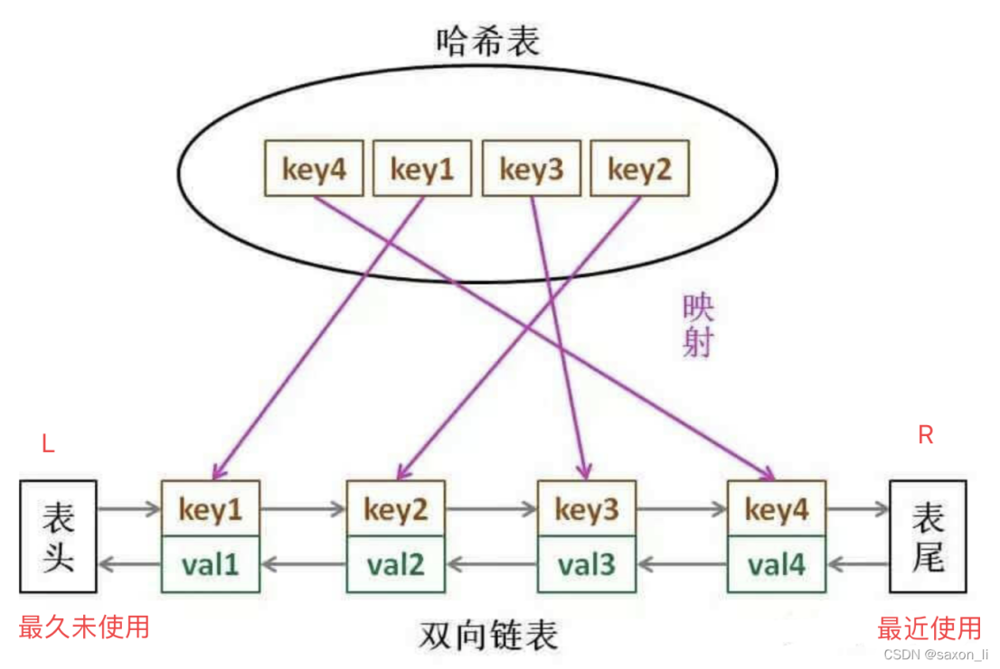

# LRU算法
## 1. LRU算法朴素实现
### 1.1. 包含知识
哈希表、==双向链表==
### 1.2. 代码 
这个是力扣146的题目，感兴趣也可以去看看
[LRU缓存](https://leetcode.cn/problems/lru-cache/description/)

```cpp
class LRUCache {
private:
    struct Node{//建立双向链表节点
        int key;
        int value;
        Node *pre,*next;
        Node(int k,int v){//构造函数，输入键值对kv
            key=k;
            value=v;
            pre=nullptr;
            next=nullptr;
        }
    };
    int n;//设置容量
    unordered_map <int,Node*> hash;//哈希表，存储key与node的对应
    Node *L,*R;//设置哨兵节点

    void remove(Node *node){//移除节点函数
        Node *pre=node->pre;
        Node *next=node->next;//获取到该节点的前驱节点和后继节点

        pre->next=next;
        next->pre=pre;//前驱节点的后继指针指向后继节点，后继节点的前驱指针指向前驱节点

        hash.erase(node->key);//在哈希表中移除对应节点
    }

    void insert(int key,int value){//插入新节点到尾部
        Node *pre=R->pre;
        Node *next=R;//获取尾部节点和尾部R哨兵节点

        Node *newnode=new Node(key,value);//创造新节点

        pre->next=newnode;
        newnode->next=next;//后继方向处理

        R->pre=newnode;
        newnode->pre=pre;//前驱方向处理

        hash[key]=newnode;//更新哈希表
    }

public:
    LRUCache(int capacity) {//初始化
        n=capacity;//分配容量

        L=new Node(-1,-1);
        R=new Node(-1,-1);//为哨兵节点分配内存空间

        L->next=R;
        R->pre=L;//将哨兵节点相连
    }
    
    int get(int key) {//访问节点
        if(hash.find(key)!=hash.end()){//检查是否存在
            Node *node=hash[key];//获取节点
            remove(node);//移除节点
            insert(node->key,node->value);//添加节点

            return node->value;
        }
        else return -1;
    }
    
    void put(int key, int value) {
        if(hash.find(key)!=hash.end()){//已经存在则更新数据
            Node *node=hash[key];
            remove(node);
            insert(key,value);
        }
        else{//还未存在
            if(hash.size()==n){//若容量已满，逐出最久未使用关键字（链表头节点）
                Node *node=L->next;
                remove(node);
                insert(key,value);
            }
            else{//容量未满，直接加入即可
                insert(key,value);
            }
        }
    }
};
```

### 1.3. 解析
**最近最少使用算法**（LRU，Least Recently Used）是一种常见的缓存替换策略，用于在缓存满时淘汰最近最少使用的数据项。其基本思想是，当缓存达到容量上限时，优先移除最近最少使用的数据项，以腾出空间给新的数据项。

为什么要使用双向链表与哈希表？

**双向链表**：

* 快速插入和删除：双向链表允许在 O(1) 时间内插入和删除节点，这对于频繁更新最近使用数据的场景非常高效。
* 保持顺序：链表可以保持数据项的访问顺序，使得最近使用的数据项总是在链表的头部，而最久未使用的数据项在尾部。

**哈希表**：

* 快速查找：哈希表可以在 O(1) 时间内查找数据项，这对于快速定位缓存中的数据至关重要。
* 兼顾查找和更新：结合双向链表，哈希表可以快速定位链表中的节点，并进行相应的插入和删除操作。


## 2. LRU算法（定时过期）
### 2.1. 包含知识
哈希表，双向链表，==ctime头文件==
### 2.2. 代码
#### 2.2.1. 程序
```cpp
#include <unordered_map>
#include <ctime>
#include <iostream>
#include <thread> // 用于 sleep
using namespace std;

const int ttl = 5; // 过期间隔，单位为秒

class LRUwithTTL {
private:
    struct Node {
        int key;
        int value;
        time_t expiretime;
        Node* pre, * next;
        Node(int key, int value, time_t expiretime) {
            this->key = key;
            this->value = value;
            this->expiretime = expiretime;
            pre = nullptr;
            next = nullptr;
        }
    };
    int n;//设置容量
    unordered_map<int, Node*> hash;//哈希表，储存键与节点的对应关系
    Node* L, * R;


    // 从链表和哈希表中移除节点
    void remove(Node* node) {
        Node* pre = node->pre;
        Node* next = node->next;

        pre->next = next;
        next->pre = pre;
        hash.erase(node->key);
    }

    // 插入节点到链表尾部并更新哈希表
    void insert(int key, int value) {
        time_t curTime;
        curTime = time(nullptr);//获取当前时间
        Node* newnode = new Node(key, value, curTime + ttl);

        Node* pre = R->pre;
        Node* next = R;

        pre->next = newnode;
        newnode->next = next;

        next->pre = newnode;
        newnode->pre = pre;

        hash[key] = newnode;//更新哈希表
    }

public:
    // 构造函数，初始化容量和链表边界
    LRUwithTTL(int capacity) {
        n = capacity;
        L = new Node(-1, -1, 0);
        R = new Node(-1, -1, 0);//初始化哨兵节点
        L->next = R;
        R->pre = L;
    }

    // 获取缓存中的值
    int get(int key) {
        if (hash.find(key) != hash.end()) {
            Node* node = hash[key];
            time_t curTime;
            curTime = time(nullptr);
            if (difftime(node->expiretime, curTime) <= 0) {
                remove(node);
                return -1;
            }
            else {
                remove(node);
                insert(node->key, node->value);
                return node->value;
            }
        }
        else {
            return -1;
        }
    }

    // 插入或更新缓存
    void put(int key, int value) {
        if (hash.find(key) != hash.end()) 
        {
            Node* node = hash[key];
            remove(node);
            insert(key, value);
       }
        else {
            if (hash.size() == n) {
                time_t curTime;
                curTime = time(nullptr);
                bool isExpire = false;
                unordered_map <int, Node*> ::iterator it;
                for (it = hash.begin(); it != hash.end(); it++) {
                    if (difftime(it->second->expiretime, curTime) <= 0) {
                        isExpire = true;
                        break;
                    }
                }
                if (isExpire) {
                    remove(it->second);
                    insert(key, value);
                }
                else {
                    Node* node = L->next;
                    remove(node);
                    insert(key, value);
                }
            }
            else {
                insert(key, value);
            }
        }
    }
```
#### 2.2.2. 调试
```cpp
    // 打印缓存状态（仅用于调试）
    void printCache() {
        cout << "Cache Content: ";
        Node* cur = L->next;
        while (cur != R) {
            cout << "(" << cur->key << "," << cur->value << ") ";
            cur = cur->next;
        }
        cout << endl;
    }
 };

// 主函数
int main() {
    // 创建一个容量为 3 的 LRUwithTTL 缓存
    LRUwithTTL cache(3);

    // 测试 put 和 get 操作
    cache.put(1, 10);
    cache.put(2, 20);
    cache.put(3, 30);

    // 打印缓存状态
    cache.printCache();

    // 获取缓存中的值
    cout << "Get key 1: " << cache.get(1) << endl; // 输出 10
    cout << "Get key 2: " << cache.get(2) << endl; // 输出 20

    // 插入新值，触发 LRU 替换
    cache.put(4, 40);

    // 打印缓存状态
    cache.printCache();

    // 获取已过期的值
    cout << "Get key 3 (should expire): " << cache.get(3) << endl; // 输出 -1

    this_thread::sleep_for(chrono::seconds(6)); // 休眠 6 秒，使节点 过期

    // 获取缓存中的值
    cout << "Get key 1: " << cache.get(1) << endl; // 输出 -1
    cout << "Get key 2: " << cache.get(2) << endl; // 输出 -1
    return 0;
}
```
#### 2.2.3. 输出
```
Cache Content: (1,10) (2,20) (3,30)
Get key 1: 10
Get key 2: 20
Cache Content: (1,10) (2,20) (4,40)
Get key 3 (should expire): -1
（等待6秒，控制台显示）
Get key 1: -1
Get key 2: -1

```
### 2.3. 解析
**定时过期**与**朴素版**的区别与优点？

**区别**
* 传统 LRU：仅基于访问顺序淘汰数据，数据不会自动过期。
* 定时更新（TTL）：结合访问顺序和时间，数据会自动过期。

**优点**
* 数据一致性：TTL 定期清除过期数据，避免缓存中出现错误或过时的数据。
* 动态适应：缓存根据时间动态更新，更适合时间敏感的应用场景（如实时数据）。
* 缓存命中率优化：结合时间和 LRU 策略，既保留热点数据，又及时清理过期数据。

## 中道崩殂
实际上缓存系统的编写是建立在面向对象与模板之上的，各位倒是可以试试幼儿园级别的编程形式（不至于），在自己的计算机中小小实现一下lru的缓存方式，嗯，还是把重要的部分放在后面来谈吧