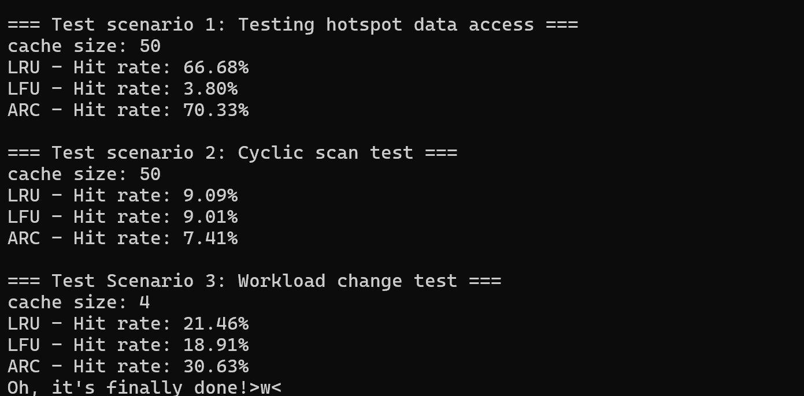

# 功能测试
恭喜各位写到这一步，关于我们缓存系统的代码已经全部结束，但这还远远不够，无论哪一个系统都需要进行检验和测试。
## 辅助测试
```
//计时类
class Timer {
public:
	Timer(): start_(std::chrono::high_resolution_clock::now())
	{}
	//计算从该对象到调用elapsed方法的时间间隔，返回毫秒级别的精度
	double elapsed() {
		auto now = std::chrono::high_resolution_clock::now();//记录调用这个方法时的时间点
		return std::chrono::duration_cast<std::chrono::milliseconds> (now - start_).count();
	}

private:
	std::chrono::time_point<std::chrono::high_resolution_clock> start_;//存储计时器的起始时间点


};

//辅助函数：打印结果
void printResult(const std::string& testName, int capacity,
	const std::vector<int>& get_operations,
	const std::vector<int>& hits)
{
	//输出命中率，小数点保留两位
	std::cout << "cache size: " << capacity << std::endl;
	std::cout << "LRU - Hit rate: " << std::fixed << std::setprecision(2)
		<< (100.0 * hits[0] / get_operations[0]) << "%" << std::endl;
	std::cout << "LFU - Hit rate: " << std::fixed << std::setprecision(2)
		<< (100.0 * hits[1] / get_operations[1]) << "%" << std::endl;
	std::cout << "ARC - Hit rate: " << std::fixed << std::setprecision(2)
		<< (100.0 * hits[2] / get_operations[2]) << "%" << std::endl;
}

```
构造了计时类和打印函数，来辅助完成
## 热点数据测试
```
void testHotDataAccess() {
	std::cout << "\n=== Test scenario 1: Testing hotspot data access ===" << std::endl;
	
	const int CAPACITY = 50; //增加缓存容量
	const int OPERATIONS = 500000; //增加操作次数
	const int HOT_KEYS = 20; //增加热点数据的数量，热点数据范围
	const int COLD_KEYS = 5000; //冷数据范围

	CopCache::CopLruCache<int, std::string> lru(CAPACITY);
	CopCache::CopLfuCache<int, std::string> lfu(CAPACITY);
	CopCache::CopArcCache<int, std::string> arc(CAPACITY);
	
	std::random_device rd;//创建随机数生成器，生成真随机数种子
	std::mt19937 gen(rd());//基于种子生产伪随机序列


	std::array<CopCache::CopCachePolicy<int, std::string>*, 3> caches = { &lru,&lfu,&arc };
	std::vector<int> hits(3, 0);
	std::vector<int> get_operations(3, 0);

	//对于三个缓存
	for (int i = 0; i < caches.size(); ++i)
	{
		//先进行一系列put操作
		for (int op = 0; op < OPERATIONS; ++op) {
			int key;
			if (op % 100 < 70) {//70%热点数据
				key = gen() % HOT_KEYS;
			}
			else { //30%冷数据
				key = HOT_KEYS + (gen() % COLD_KEYS);
			}
			std::string value = "value" + std::to_string(key);
			caches[i]->put(key, value);
		}

		//然后进行随机的get操作
		for (int get_op = 0; get_op < OPERATIONS; ++get_op) {
			int key;
			if (get_op % 100 < 70) { //70%概率访问热点
				key = gen() % HOT_KEYS;
			}
			else { //30%概率访问冷数据
				key = HOT_KEYS + (gen() % COLD_KEYS);
			}

			std::string result;//传出参数
			get_operations[i]++;//对应操作次数增加
			//判断在缓存中是否存在对应key值,存在则命中加一
			if (caches[i]->get(key, result)) {
				hits[i]++;
			}
		}
	}
	printResult("Hotspot data access test", CAPACITY, get_operations, hits);
}
```

## 循环扫描测试
```
void testLoopPattern() {
	std::cout << "\n=== Test scenario 2: Cyclic scan test ===" << std::endl;

	const int CAPACITY = 50;//增加缓存容量
	const int LOOP_SIZE = 500;
	const int OPERATIONS = 200000;//增加操作次数

	CopCache::CopLruCache<int, std::string> lru(CAPACITY);
	CopCache::CopLfuCache<int, std::string> lfu(CAPACITY);
	CopCache::CopArcCache<int, std::string> arc(CAPACITY);

	std::array<CopCache::CopCachePolicy<int, std::string>*, 3> caches = { &lru,&lfu,&arc };
	std::vector<int> hits(3, 0);
	std::vector<int> get_operations(3, 0);

	std::random_device rd;//创建随机数生成器，生成真随机数种子
	std::mt19937 gen(rd());//基于种子生产伪随机序列

	//先填充数据
	for (int i = 0; i < caches.size(); ++i) {
		for (int key = 0; key < LOOP_SIZE; ++key) {//只会填充LOOP_SIZE范围的数据
			std::string value = "loop" + std::to_string(key);
			caches[i]->put(key, value);
		}

		//然后进行访问测试
		int current_pos = 0;
		for (int op = 0; op < OPERATIONS; ++op) {
			int key;
			if (op % 100 < 60) { //60% 顺序扫描
				key = current_pos;
				current_pos = (current_pos + 1) % LOOP_SIZE;
			}
			else if (op % 100 < 90) {//30% 随机跳跃
				key = gen() % LOOP_SIZE;
			}
			else { //10%为访问范围外数据
				key = LOOP_SIZE + (gen() % LOOP_SIZE);
			}

			std::string result;//传出参数
			get_operations[i]++;
			if (caches[i]->get(key, result)) {
				hits[i]++;
			}

		}
	}

	printResult("Cyclic scan test", CAPACITY, get_operations, hits);
}

```

## 工作负载剧烈变化
```
void testWorkloadShift() {
	std::cout << "\n=== Test Scenario 3: Workload change test ===" << std::endl;

	const int CAPACITY = 4;//缓存容量极小
	const int OPERATIONS = 80000;//操作次数极大
	const int PHASE_LENGTH = OPERATIONS / 5;//切分操作次数为不同模式

	CopCache::CopLruCache<int, std::string> lru(CAPACITY);
	CopCache::CopLfuCache<int, std::string> lfu(CAPACITY);
	CopCache::CopArcCache<int, std::string> arc(CAPACITY);

	std::random_device rd;
	std::mt19937 gen(rd());

	std::array<CopCache::CopCachePolicy<int, std::string>*, 3> caches = { &lru,&lfu,&arc};
	std::vector<int> hits(3, 0);
	std::vector<int> get_operations(3, 0);

	//填充一些初始数据
	for (int i = 0; i < caches.size(); ++i) {
		for (int key = 0; key < 1000; ++key) {
			std::string value = "init" + std::to_string(key);
			caches[i]->put(key, value);
		}

		//然后进行多阶段测试
		for (int op = 0; op < OPERATIONS; ++op) {
			int key;
			//根据不同阶段选择不同的访问模式
			if (op < PHASE_LENGTH) {//热点访问
				key = gen() % 5;
			}
			else if (op < PHASE_LENGTH * 2) {//大范围随机
				key = gen() % 1000;
			}
			else if (op < PHASE_LENGTH * 3) {//顺序扫描
				key = (op - PHASE_LENGTH * 2) % 100;
			}
			else if (op < PHASE_LENGTH * 4) {
				int locality = (op / 1000) % 10;
				key = locality * 20 + (gen() % 20);
			}
			else { //混合扫描
				int r = gen() % 100;
				if (r < 30) {
					key = gen() % 5;//热点扫描
				}
				else if (r < 60) {
					key = 5 + (gen() % 95);//小范围扫描
				}
				else {
					key = 100 + (gen() % 900);//大范围扫描
				}
			}

			std::string result;
			get_operations[i]++;
			if (caches[i]->get(key, result)) {
				hits[i]++;
			}

			//随机进行put操作，更新缓存内容
			if (gen() % 100 < 30) { //30%概率进行put
				std::string value = "new" + std::to_string(key);
				caches[i]->put(key, value);
			}
		}
	}

	printResult("Drastic changes in workload testing", CAPACITY, get_operations, hits);
}

```

## 测试结果


## 总结
这毕竟不是专业的测试，很多结果不能保证合理和正确，比如在热点测试的时候,LFU表现地相当差劲，这可能是因为我们设置了最大访问频次限制，导致冷数据涌入污染热点数据，反而LRU因为设置了允许进入缓存的k值表现良好。当然这只是我的一面之词，更多优秀的测试由各位来完成吧！

